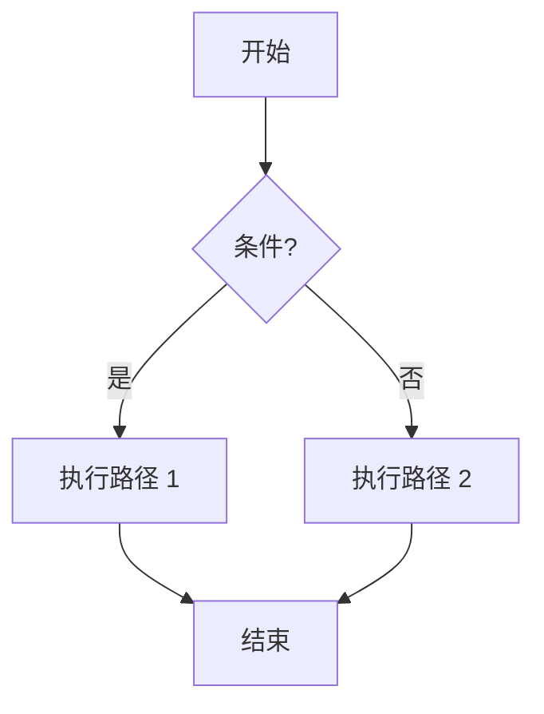
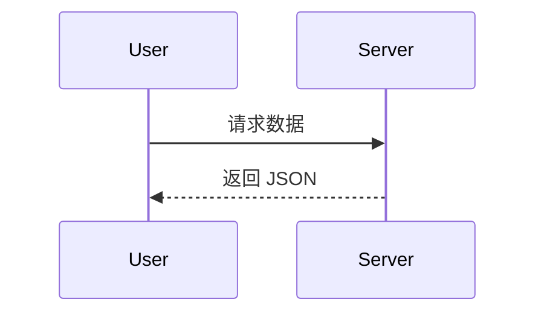

<!-- 本文件旨在作为“全语法对照与演示”，并非所有渲染器都支持全部特性。 -->

[TOC]

[[toc]]

# H1：ATX 形式（#）

说明段落：这是一个普通段落，用于展示基本排版。行尾两个空格实现软换行  
这是一行（软换行）。使用 `<br>` 也可以强制换行<br>这是另一行。

一级标题（Setext）
=================

二级标题（Setext）
-----------------

## H2：强调与行内样式

- 斜体：*italic* 或 _italic_
- 加粗：**bold** 或 __bold__
- 斜粗体：***bold italic***
- 删除线（GFM）：~~strikethrough~~
- 高亮（Typora/Obsidian 常见）：==highlight== 或 <mark>highlight</mark>
- 下划线（HTML）：<u>underline</u>
- 上标/下标（部分方言）：X^2^，H~2~O；HTML 方案：X<sup>2</sup> 与 H<sub>2</sub>O
- 代码（行内）：`inline code`
- 键盘键：<kbd>Cmd</kbd>+<kbd>C</kbd>
- 转义示例：\*不作为列表\*，\_不作为强调\_

水平分隔线：

---

***

___

## H2：引用（Blockquote）与提醒块（Obsidian Callout）

> 这是一个引用。
>
> 引用可以包含多个段落。
>
> - 甚至列表
> - 以及 `行内代码`

> 嵌套引用：
>> 二级引用
>>> 三级引用

> [!NOTE] 这是 Obsidian 的提醒块（Callout）
> 支持多种类型：NOTE/INFO/TIP/IMPORTANT/WARNING/CAUTION/QUOTE/EXAMPLE 等

> [!WARNING]
> 小心边缘情况与渲染差异。

## H2：列表（无序、有序、任务清单）

无序列表（- / + / * 都可）：

- 项目 A
  - 子项 A1
    - 子项 A1-1
- 项目 B

也可以：

* 星号开头
* 另一项

或使用加号：

+ 加号项 1
+ 加号项 2

有序列表（数字不需连续，按 CommonMark 渲染）：

1. 第一项
2. 第二项
7. 第三项（源文档写 7.，渲染时通常仍显示序号递增）

从自定义序号开始（HTML 方式）：

<ol start="3">
  <li>第三项（start=3）</li>
  <li>第四项</li>
</ol>

任务清单（GFM）：

- [ ] 未完成事项
- [x] 已完成事项
  - [ ] 子任务未完成
  - [x] 子任务已完成
- [-] 部分完成（部分渲染器支持）

## H2：链接与引用

- 行内链接：[示例站点](https://example.com "可选标题")
- 自动链接：<https://github.com>
- 邮件链接：<hello@example.com>
- 引用式链接（参考式）：[去 Google][google]
- 本地锚点链接：[跳转到“数学公式”](#h2数学公式)
- Obsidian 内链：[[all-markdown-syntax|别名指向本文件]]
- Obsidian 内链到标题：[[all-markdown-syntax#H2：数学公式|跳到数学]]
- Obsidian 块引用：[[all-markdown-syntax#^block-demo]] 与嵌入：![[all-markdown-syntax#^block-demo]]

[google]: https://www.google.com "Google"

## H2：图片与图像变体

行内图片：


引用式图片：

![Logo][logo]

图片作为链接：

[](https://example.com)

Obsidian 图片嵌入（本地资源示例，渲染器需支持）：

![[assets/sample.png]]

HTML 语义容器：

<figure>
  
  <figcaption>图注：图像说明文字</figcaption>
</figure>

[logo]: https://via.placeholder.com/120x60 "引用式图片标题"

## H2：表格（GFM）

基本表格与对齐：

| 列 1 | 左对齐 | 居中对齐 | 右对齐 |
|------|:-------|:--------:|-------:|
| 文本 | left   | center   |  right |
| 格式 | **粗体** | `代码`   | [链接](https://example.com) |
| 多行 | 使用 <br> 换行 | 123 | 456 |

复杂内容可使用 HTML：

<table>
  <thead>
    <tr>
      <th>列 A</th>
      <th>列 B</th>
    </tr>
  </thead>
  <tbody>
    <tr>
      <td>
        支持块级内容：
        <ul>
          <li>列表</li>
          <li>段落</li>
        </ul>
      </td>
      <td>
        <blockquote>表格中的引用</blockquote>
      </td>
    </tr>
  </tbody>
</table>

## H2：代码块（缩进、围栏、语法高亮、Diff、Mermaid）

缩进代码块（四个空格或一个制表符）：

    function hello(name) {
      return `Hello, ${name}!`;
    }

围栏代码块（``` 与 ~~~ 都可）：

```js
// 带语言标识的代码高亮（JavaScript）
export function sum(a, b) {
  return a + b;
}
```

~~~bash
# Bash 示例
echo "Hello"
ls -la | grep "md"
~~~

带标题信息（部分渲染器支持 info string 或标题语法）：

```json title="config.json"
{
  "name": "demo",
  "version": "1.0.0"
}
```

Diff 代码块（GFM）：

```diff
diff --git a/app.js b/app.js
--- a/app.js
+++ b/app.js
@@
 function calc(n) {
-  return n * 2;
+  return n * 3;
 }
```

Mermaid（部分平台原生支持，如 GitHub）：



序列图（Mermaid）：



## H2：脚注（GFM）

这是一个带脚注的句子[^foot-1]，也可以多个脚注[^foot-2]。

[^foot-1]: 脚注内容一。可包含段落与列表等。

[^foot-2]: 脚注内容二。

## H2：定义列表（Definition List，部分方言/渲染器）

术语一
: 这是术语一的定义。

术语二
: 定义可包含多行。
: 继续补充说明。

## H2：缩写（Abbreviations，部分方言/渲染器）

在某些渲染器中可以使用缩写：HTML 与 CSS 将被解释。

*[HTML]: 超文本标记语言
*[CSS]: 层叠样式表

## H2：数学公式（Typora/Obsidian 常见，需 MathJax/KaTeX）

行内公式示例：\( a^2 + b^2 = c^2 \)，或 $E=mc^2$。

块级公式（LaTeX）：

$$
\int_{-\infty}^{\infty} e^{-x^2} \, dx = \sqrt{\pi}
$$

另一种块级写法：

\[
\nabla \cdot \vec{E} = \frac{\rho}{\varepsilon_0}
\]

## H2：内联与块级 HTML（兼容性视渲染器而定）

内联元素：<span style="color:#d6336c">带样式的文字</span>，<abbr title="Application Programming Interface">API</abbr>

折叠块：

<details>
  <summary>点击展开 / 折叠</summary>
  <p>这是可折叠内容。</p>
  <ul>
    <li>支持列表</li>
    <li>也可嵌套其他 Markdown</li>
  </ul>
</details>

对齐（HTML）：

<p align="center">居中文本</p>

## H2：注释与元信息

HTML 注释不会显示：<!-- 这是注释，将在多数渲染器中被隐藏 -->

前言区（Front Matter）示例已包含在文首，用于静态站点或知识库系统。

## H2：Obsidian 专用特性示例

- 标签（Tags）：#示例 #Markdown/进阶 #obsidian
- 块 ID：这一段落带有块标识符。^block-demo
- 通过 `[[文件#标题]]`、`[[文件#^块ID]]` 进行跳转或引用
- 嵌入整页或片段：`![[文件]]`、`![[文件#标题]]`
- Callout 已在前文演示（如 [!NOTE] / [!WARNING]）

## H2：Typora 常见用法补充

- 目录生成占位：`[TOC]`（已在文首演示）
- 高亮：`==高亮==`
- 多学科公式渲染需启用 MathJax/KaTeX

## H2：字符转义与特殊符号

需要字面显示保留字：\* \_ \` \{ \} \[ \] \( \) \# \+ \- \! \|

显示竖线（管道）以用于表格说明：\| 管道符

## H2：引用他人或提及（平台相关）

- GitHub 提及：@octocat（仅在 GitHub 上有效）
- Emoji（GFM）：:tada: :sparkles: :warning:

## H2：锚点与自定义 ID（部分方言如 Kramdown）

### 带自定义 ID 的标题 {#custom-id}

现在可以使用 [自定义锚点](#custom-id) 进行跳转（是否生效取决于渲染器）。

## H2：综合示例段落

在这一段中，我们将综合使用多种语法：**加粗**、*斜体*、~~删除线~~、`代码`、==高亮==、H<sub>2</sub>O、X<sup>2</sup>，并引用脚注[^foot-2]；还会用到一个链接到[数学部分](#h2数学公式)，并在末尾放一条水平线。

---

## H2：结束语

并非所有渲染器都支持所有特性；当你将本文导出为 PDF 或在不同平台预览时，可能会看到略有差异。建议在目标平台测试关键语法的呈现效果。


